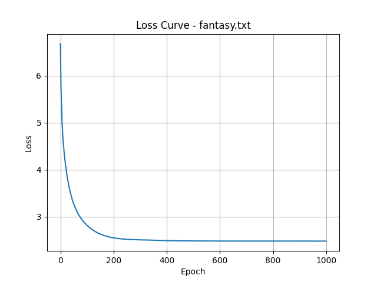

# Makemore Name Generator

A small character-level name generator built with PyTorch. It learns from a text file, saves a trained model, and samples new names through either the command line or a Gradio interface.

The model uses a three-character context and a compact multilayer perceptron. The repository includes datasets for regular names, Pokémon-style names, and fantasy names.

## Setup

```bash
git clone https://github.com/kyan9400/makemore-namegen.git
cd makemore-namegen

python -m venv .venv
```

Activate the environment:

```powershell
.\.venv\Scripts\Activate.ps1
```

On macOS or Linux:

```bash
source .venv/bin/activate
```

Install the dependencies:

```bash
python -m pip install torch gradio matplotlib
```

## Train

Train on the default names dataset:

```bash
python train.py
```

Choose another dataset with `--file`:

```bash
python train.py --file pokemon.txt
python train.py --file fantasy.txt
```

The script writes a model file named after the dataset and saves the latest loss curve to `loss_curve.png`.



## Generate names

```bash
python generate.py --file names.txt --n 20
```

Sampling can be adjusted with temperature and top-k:

```bash
python generate.py --file fantasy.txt --n 20 --temp 0.9 --topk 8
```

## Run the interface

```bash
python app.py
```

The Gradio app supports dataset selection, prefixes, temperature, top-k sampling, and light or dark themes.

## Project layout

```text
model.py      neural-network definition
vocab.py      character vocabulary
train.py      training and loss plotting
generate.py   command-line generation
app.py        Gradio interface
*.txt         training datasets
```
